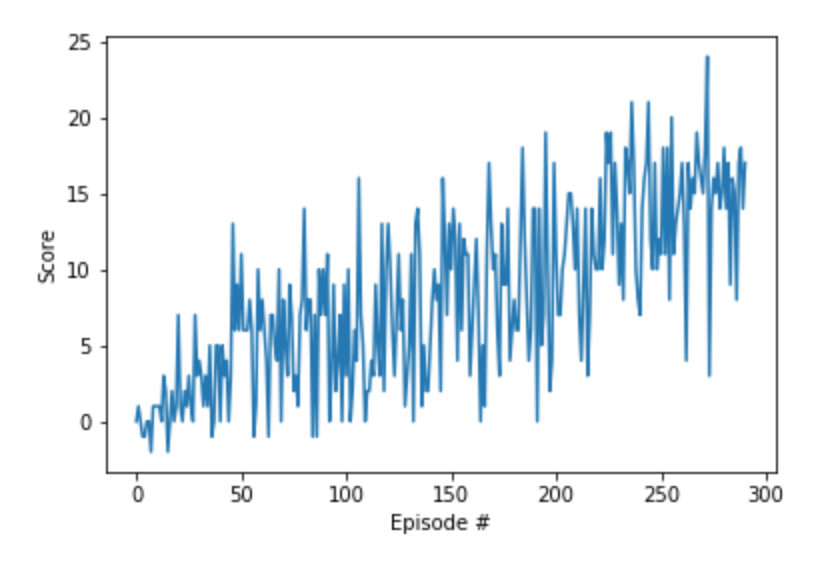

# Project 1 Report

## Learning Algorithm

The implementation is a simple Deep Q-Network with three fully connected layers: two hidden layers of 64 units each with ReLU activation and an output layer of 4 units (one for each action). The hyperparameters are as follows:

| Hyperparameter | Value |
| ------------- | ------------- |
| first hidden layer units | 64 |
| second hidden layer units | 64 |
| replay buffer size | 1e6 |
| batch size | 64 |
| discount factor (gamma) | 0.99 |
| tau* | 1e-3 |
| learning rate | 25e-5 |
| update the network every __ time steps | 4 |
| number of episodes | 1000 |
| max time steps per episode | 1000 |
| starting epsilon value | 1.0 |
| ending epsilon value | 1e-3 |
| epsilon decay rate | 0.95 |

*Tau is the percentage of weights from the local model to carry over to the target model during the soft update of target parameters; meanwhile, `1 - tau` is the percentage of target model weights to carry over.

## Plot of Rewards

The plot below shows that, after 291 episodes, the agent is able to receive an average reward of 13 over the last 100 consecutive episodes.

From the Final Run section of `Navigation.ipynb`, we have calculated that the average number of episodes required to solve the environment is 296, with a median of 289. This is from 10 trial runs of the manually-found optimal hyperparameters displayed in the table above.

## Ideas for Future Work

Ideas for improving the agent's performance are as follows:
- Attempt a double DQN, dueling DQN, and prioritized experience replay.
- Solve the environment in fewer than 200 episodes.
- See how large the rewards can get before the environment is solved (do not stop at 13).
- Improve the evaluation metric by increasing the window size in which to measure the agent's performance (such as the average score over the last 300 consecutive episodes instead of 100).
