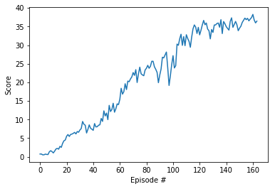

# Project 2 Report

## Learning Algorithm

We use the Deep Deterministic Policy Gradients ([DDPG](https://arxiv.org/abs/1509.02971)) learning algorithm in this project. DDPG is an off-policy model-free algorithm that uses neural networks to learn policies, even in high-dimensional and continuous action spaces. The implementation is a DDPG agent with three fully connected layers: hidden layers of 500 and then 375 units, each with ReLU activation, and an output layer of 4 units with tanh applied in order to bound the output between -1 and 1. That was the actor network specifically. The critic network is similar, except that tanh is not applied to the output layer and the action vector is included between the first and second hidden layers. The hyperparameters are as follows:

| Hyperparameter | Value |
| ------------- | ------------- |
| first hidden layer units | 500 |
| second hidden layer units | 375 |
| replay buffer size | 1e5 |
| batch size | 128 |
| discount factor (gamma) | 0.99 |
| tau* | 1e-3 |
| actor learning rate | 1e-4 |
| critic learning rate | 1e-3 |
| number of episodes | 1000 |
| max time steps per episode | 1000 |
| L2 weight decay | 0 |

*Tau is the percentage of weights from the local model to carry over to the target model during the soft update of target parameters; meanwhile, `1 - tau` is the percentage of target model weights to carry over.

## Results

| Trial | Episode 20 Score | Episode 50 Score | Episode 100 Score | # of Episodes to Solve | Runtime (hh:mm/#_eps) | Description | Comments |
| ------------- | ------------- | ------------- | ------------- | ------------- | ------------- | ------------- | ------------- |
| [Initial Run](https://github.com/mrbarbasa/drlnd-projects/commit/04d1b34ccf0b1abc5c337be962099422c4f453a8) | 1.31 | 4.55 | 8.46 | 282 | 1:04/282 | Default params with 400 and 300 units for the first and second hidden layers, respectively (for both actor and critic networks) | Baseline run |
| [Trial 1](https://github.com/mrbarbasa/drlnd-projects/commit/1073d01af3baed635d5650071e406cdaf2131967) |  | 1.01 |  | Interrupted | 0:10/50 | Try 300 and 150 units for the first and second hidden layers, respectively (for both actor and critic networks) | 1.01 is much worse than 4.55 |
| [Trial 2](https://github.com/mrbarbasa/drlnd-projects/commit/767b10431254aacfd9ff35e3449745a1e4fa5aae) |  | 0.65 |  | Interrupted | 0:12/50 | Increase batch size from 128 to 256 | 0.65 is much worse than the first two trials |
| [Trial 3](https://github.com/mrbarbasa/drlnd-projects/commit/a9b3893002a1dc0720b747e012e461f254cb5854) |  | 1.93 | 1.89 | Interrupted | 0:21/100 | Decrease batch size from 128 to 64 | There was some hope, so I let it run longer, but no improvement |
| [Trial 4](https://github.com/mrbarbasa/drlnd-projects/commit/e247224ddd4b03ac6dd11f064ddce0659d34f22f) |  | 0.70 | 0.70 | Interrupted | 0:23/100 | Try an L2 weight decay of 1e-2 | Let it run for too long on accident; seemed to plateau around 0.70 |
| [Trial 5](https://github.com/mrbarbasa/drlnd-projects/commit/979745e0769b79feb2059f09c656f0ce70b0131e) | 1.78 | 5.37 | 12.91 | 164 | 0:37/164 | Try 500 and 375 units for the first and second hidden layers, respectively (for both actor and critic networks) | Best results thus far |
| [Trial 6](https://github.com/mrbarbasa/drlnd-projects/commit/0a60fd777d9c04bf6088a58eceb9fcdf34a216cb) |  |  |  | Interrupted | 0:45/15 | Update the networks 20 times per timestep and apply gradient clipping when training the critic network and **keep Trial 5 change** | No improvement at all |
| [Trial 7](https://github.com/mrbarbasa/drlnd-projects/commit/b951ea8a949d2fed663e31d068c139b591e5d384) |  |  |  | Interrupted | 0:08/50 | Update the networks 10 times every 20 timesteps and apply gradient clipping when training the critic network and **keep Trial 5 change** | No improvement at all |
| [Final Run](https://github.com/mrbarbasa/drlnd-projects/commit/e7aabace752166a4e960ac5f6b64db0460d41f3b) | 1.78 | 5.37 | 12.91 | 164 | <0:39/164 | Trial 5 changes | Similar results to Trial 5, confirming that these are the best settings out of these 9 total trials |

## Plot of Rewards

The plot below shows that, after 164 episodes, the agent is able to receive an average reward of 30 over the last 100 consecutive episodes.

## Ideas for Future Work

Ideas for improving the agent's performance are as follows:
- Attempt prioritized experience replay, TRPO, TNPG, PPO, or D4PG.
- Solve the environment in fewer than 150 episodes.
- See how large the rewards can get before the environment is solved (do not stop at 30).
